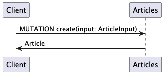
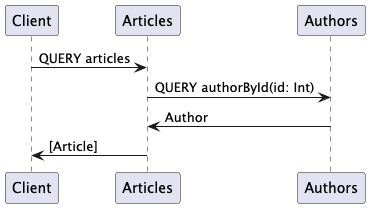
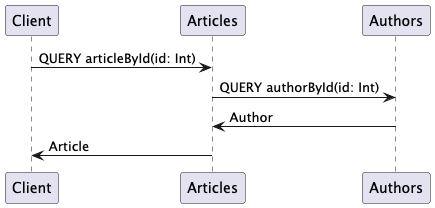
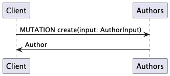
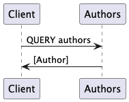
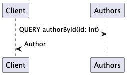

# Sample: Spring Boot, Consul & GraphQL

Sample application providing multiple modules acting as microservices using Consul as service discovery.

## Features

* Spring Boot
* Spring 
* GraphQL
* Consul
* PlantUML
* Docker & Compose
* customized `ClientHttpRequestFactory` for using service names as host for inter-service communication via GraphQL

## Build & run

Run configurations for IDEA are stored in the `.run` folder.

### Consul

Start Consul server via Docker Compose

```shell
compose up
```

* http://localhost:8500/ 

### Articles service

```shell 
mvn clean install spring-boot:run -f artices/pom.xml
```

* http://localhost:8081/graphiql?path=/graphql
* http://localhost:8081/graphql
* http://localhost:8081/actuator

### Authors service

```shell 
mvn clean install spring-boot:run -f authors/pom.xml
```

* http://localhost:8082/graphiql?path=/graphql
* http://localhost:8082/graphql
* http://localhost:8082/actuator


### Comments service

```shell 
mvn clean install spring-boot:run -f comments/pom.xml
```


## Modules / Services

### Articles Service

#### Mutations

##### Create



#### Queries

##### Articles



##### Article by ID



### Authors Service

#### Mutations

##### Create



#### Queries

##### Authors



##### Author by ID



### Comments Service

TBD